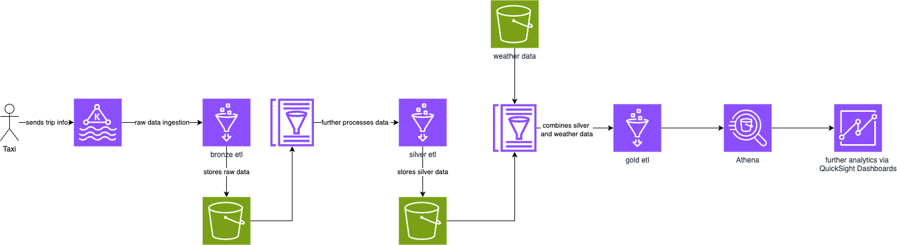

# Taxi Analytics Platform

## Overview

The Taxi Analytics Platform is designed to provide efficient and scalable data analytics for taxi ride data using the Delta Architecture. This platform allows for real-time, batch, and historical data processing, ensuring reliable and accurate insights into various aspects of taxi operations, including fare analysis, trip patterns, and customer behavior.

#### Key Features

- Delta Architecture: Combines batch and streaming data processing for scalable and fault-tolerant data workflows.
- Real-Time Analytics: Process and analyze taxi ride data as it is ingested in real time.
- Historical Insights: Efficiently query and analyze large volumes of historical data.
- Data Quality: Built-in support for handling schema evolution and managing late-arriving data, ensuring data consistency and quality.
- Optimized Storage: Uses Delta Lake for optimized data storage, enabling faster queries and efficient space management.

## Used Services

- Glue for compute
- S3 for data storage
- AWS MSK (managed kafka)
- PyDeequ (data checks)

### Future improvements
- Quicksight for analytics dashboards
- ?? Glue + spark ml for demand prediction ??

## Structure

- requirements: holds the used python dependencies
- infra: contains the iac code + etl code
- data_preparation: code used for preparing the taxi dataset
